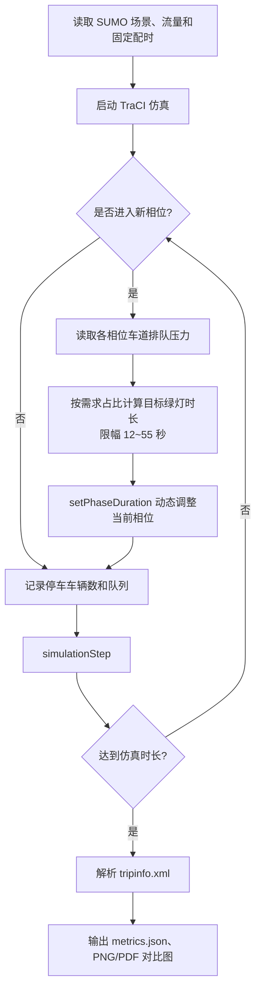

# 算法流程图与控制逻辑

## 控制流程



## 控制逻辑伪代码

```text
固定配时与自适应方案使用同一 network、route、seed
for each simulation step:
    phase = traffic_light.current_phase()
    if mode == adaptive and phase != previous_phase:
        lanes = green_lanes[phase]
        pressure[p] = sum(halting_number(lane) for lane in green_lanes[p])
        base_share = base_green[phase] / sum(base_green)
        demand_share = pressure[phase] / sum(pressure), 无压力时使用 base_share
        target = base_green[phase] + gain * (demand_share - base_share)
        target = clamp(round(target), 12, 55)
        traffic_light.setPhaseDuration(target)
    queue_samples.append(sum(halting_number(lane) for lane in incoming_lanes))
    simulationStep()
解析 tripinfo.xml，计算完成车辆、平均旅行时间、等待时间、时间损失和平均排队车辆数
```

实现位置：`01_仿真工程/run_experiment.py` 的 `run()` 函数。默认 `gain=-44`、随机种子 `42`，固定方案不执行动态调节。
