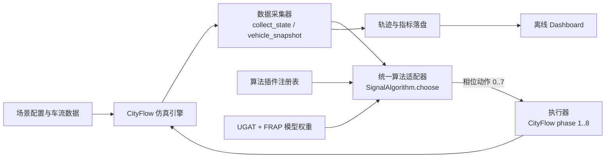
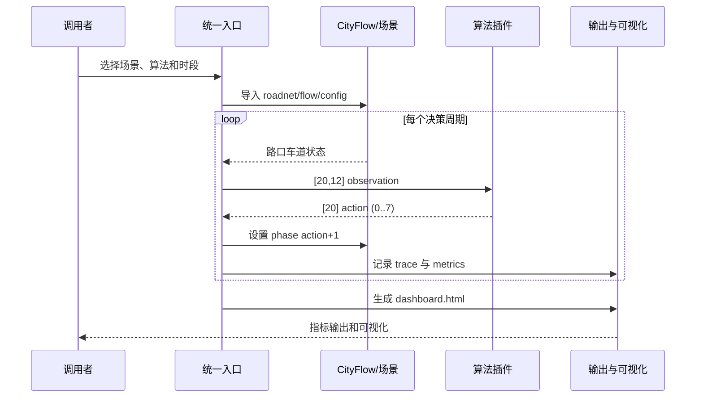

# 平台总体架构与模块边界

## 模块边界

| 模块 | 目录/入口 | 输入 | 输出 | 责任 |
| --- | --- | --- | --- | --- |
| 场景与配置 | `data/xiong_an_20`、`configs` | roadnet、flow、拓扑 | CityFlow 配置 | 固化 20 路口可复现实验输入。 |
| 引擎适配 | `src/run_cityflow.py` | 场景、算法名、运行参数 | 执行步进、原始状态 | 屏蔽 CityFlow 调用细节，保留相位映射。 |
| 数据采集 | `collect_state`、`vehicle_snapshot` | 引擎状态 | `[20,12]` 状态、车辆快照 | 把引擎数据转换为稳定算法输入，并记录可视化数据。 |
| 算法插件 | `src/algorithms.py`、`UGAT算法接口_标准化插件` | 浮点状态 | `[20]` 整数动作 | 通过统一契约替换固定配时、压力控制、TRANSYT 和 UGAT/FRAP。 |
| 结果服务 | `outputs/*.json`、`metrics.csv` | 运行过程数据 | 指标、轨迹、HTML | 输出可审计结果，向仪表盘提供离线数据。 |

## 端到端运行流程

